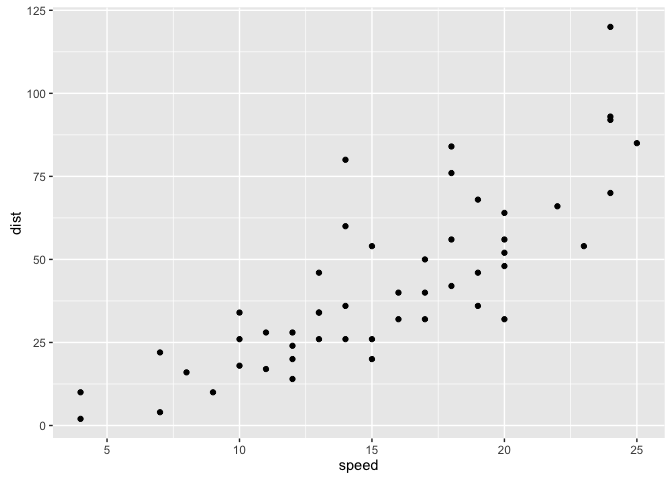

library(ggplot2) library(dplyr) qplot(x = speed, y = dist, data = cars,
geom = "point") dplyr::filter(cars, speed \< 5)

    library(ggplot2)
    library(dplyr)

    ## 
    ## Attaching package: 'dplyr'

    ## The following objects are masked from 'package:stats':
    ## 
    ##     filter, lag

    ## The following objects are masked from 'package:base':
    ## 
    ##     intersect, setdiff, setequal, union

    qplot(x = speed, y = dist, data = cars, geom = "point")

  

    filter(cars, speed < 5)

    ##   speed dist
    ## 1     4    2
    ## 2     4   10
